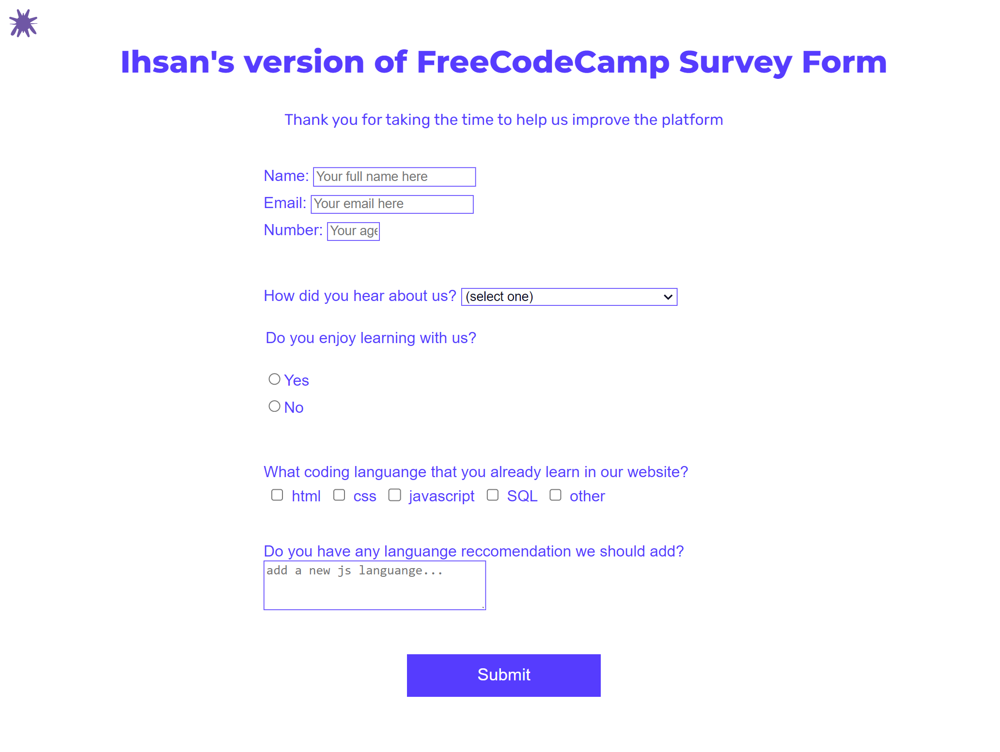

# FreeCodeCamp : Making A Form Website 

## Table of contents

  - [Captured](#Captured)
  - [Links](#links)
  - [Author](#author)
  - [Acknowledgments](#acknowledgments)

### Captured

**Photo of the website**

**Video of the website**

### Links

- Solution URL: [Add solution URL here](https://your-solution-url.com)
- Live Site URL: [Add live site URL here](https://your-live-site-url.com)

## Author

- Instagram - [Ihsanhnf_](https://www.instagram.com/ihsanhnf_/)
- github - [Ihsanhanif](https://github.com/Ihsanhanif)
- Linkedin - [Ihsanhnf](https://www.linkedin.com/in/ihsanhnf/)
